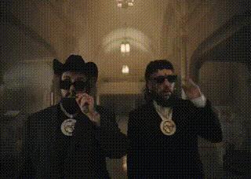

<div align="center">

# ✖️ [ SYSTEM_OVERRIDE: EVGENIY_SHR ] ✖️




---

### 🟢 MONITOR_LOGS
`[ STATUS: OPERATIONAL ]`
`[ ENCRYPTION: AES-256 ]`
`[ DNS: 94.140.14.14 ]`

---

### 💿 AUDIO_FEED: HYPERNORMALISATION
**$UICIDEBOY$ — G*59 RECORDS**
`0:47 ───⚪️────── 2:24`
`VOL: █████████████▒ 95%`

[  ](https://music.apple.com/ru/album/hypernormalisation/1743132338?i=1743132342)

---

### 💀 CORE_VAULT
```python
# LOADING_PROJECTS...
# [1] shadowrocket-config >> OPTIMIZED
# [2] g59-vault           >> ENCRYPTED
